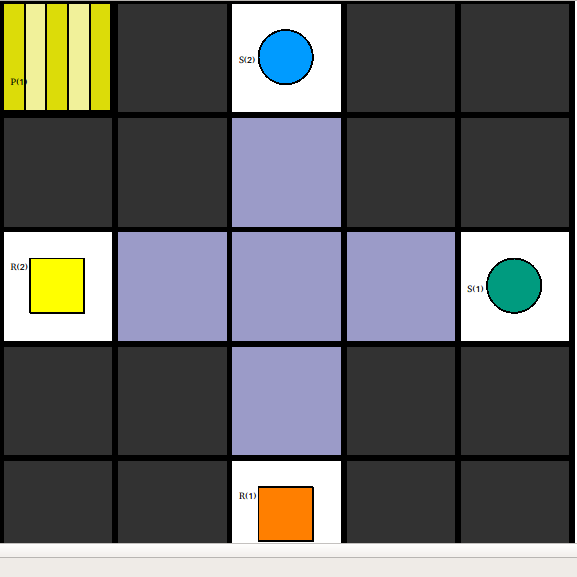

# Benchmark 1 - Vertex Constraint

## Description

With this benchmark we try to tackle the **vertex constraint** problem of our plan merger. This occurs when two robots try to enter the same node at the same time (illustrated in _Image_1_). In a real life scenario this would result in a crash of the two robots. 

Image_1 :  Vertex Conflict

 

To invoke this conflict we have created a map in which there are two, equally long, crossing corridors, which each have a robot on one end and a shelve with a product on the other. If both robots would just go straight forward for the selves they would crash in the middle (vertex conflict).

Image_2: Map View of Benchmark 1

 

This Benchmark is split into two separate instances `robot_1_instance/` and `robot_2_instance/` for the Plan-Merging-Project. 