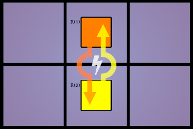
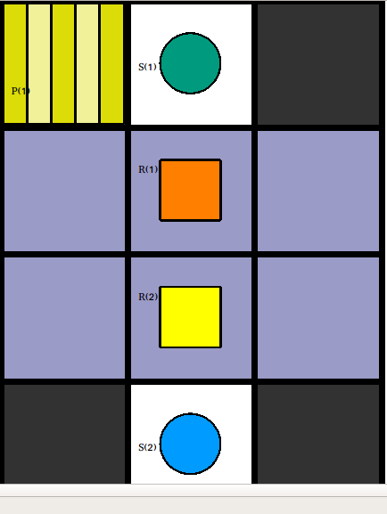

# Benchmark 2 - Edge Constraint

## Description

With this benchmark we try to tackle the **edge constraint** problem of our plan merger. This occurs when two robots are placed side by side to each other at time step *t​* and then try to switch positions at *t+1* (illustrated in _Image_1_). In a real life scenario this would result in a crash of the two robots. 

Image_1 :  Edge Conflict

 

To invoke this conflict we have created a map in which there are two robots placed side by side and they both have to move in the direction of the other robot to reach their destination shelve. If both robots would just move into the direction of the shelve they would create an edge conflict and crash.

Image_2: Map View of Benchmark 2

 

This Benchmark is split into two separate instances `robot_1_instance/` and `robot_2_instance/` for the Plan-Merging-Project. 