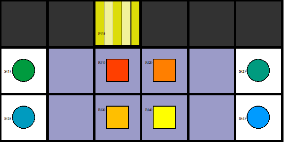

# Benchmark 4 - Multi Robot Edge Constraint

## Description

This Benchmark tackles again the problem of Edge conflicts. This time instead of just two Robots, this benchmark contains four Robots which encounter an edge conflict.

Image_1 : Map View of Benchmark 4

 

This Benchmark is split into four separate instances `robot_1_instance/`, `robot_2_instance/`, `robot_3_instance/`and `robot_4_instance/` for the Plan-Merging-Project. 

The separate Plans for all robots are found in the `plans/` directory