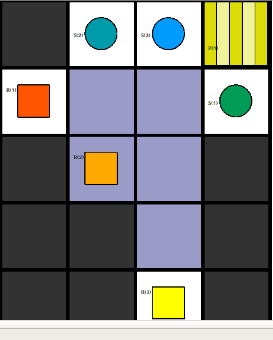

# Benchmark 3 - Multi Robot Vertex Constraint

## Description

In this Benchmark we want to cover the case two vertex conflicts in a row. Robot 1 has in the first time step a vertex conflict with Robot 2. Robot 1 hast to wait one time step for Robot 2 to pass and then moves on to the right. But in the next time step t=3 there is another vertex conflict with Robot 3 that was just created through the robot waiting at time step 1! The Plan Merger has to be able to deal with a Problem like this.

Image_1 : Map View of Benchmark 3

  

This Benchmark is split into three separate instances `robot_1_instance/`, `robot_2_instance/` and`robot_3_instance/` for the Plan-Merging-Project. 

The separate Plans for all robots are found in the `plans/` directory