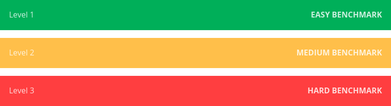

# Benchmarks

For this project in multi agent plan merging we have created several benchmarks to test, validate and optimise our solutions on.

Each Benchmark has a Level assigned to it which indicates the difficulty of the benchmark. Level 1 Benchmarks are Basic Scenarios with only two Robots which are the easiest to solve. Level 2 Benchmarks get a bit more complicated and Level 3 Benchmarks are Multi Robot and require a pretty mature Plan Merger to be solved correctly.

### Benchmark Difficulties :

 

## Structure

1. **Vertex Constraint Benchmark [Level 1]** - 
   + With this Benchmark we want to test for vertex constraints
   + It consists of two Robots which while having to cross each other have to avoid a vertex conflict (crash)
2. **Edge Constraint Benchmark [Level 1]** - 
   + With this Benchmark we want to test for edge constraints
   + It consists of two Robots which are placed side by side and trying to move in the direction of each other
   + They have to avoid an edge conflict (crash)
3. **Vertex Constraint Benchmark [Multi Robot] [Level 3]** - 
   + Another Vertex Constraint Benchmark but this time instead of just two Robots, there are multiple
4. **Edge Constraint Benchmark [Multi Robot] [Level 3]** - 
   + Another Edge Constraint Benchmark but this time instead of just two Robots, there are multiple
5. **Conflict through waiting [Multi Robot] [Level 2]** - 
   + A Plan Merger that chooses to avoid vertex conflicts through waiting can create new Vertex and Edge Conflicts that weren't there before. This Benchmark deals with this problem.

